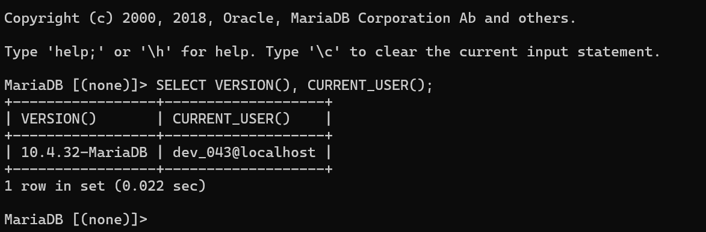
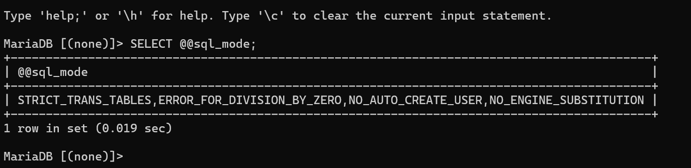
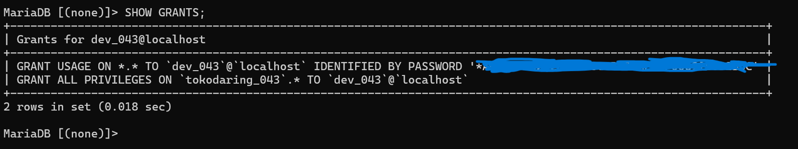
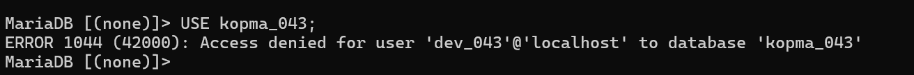
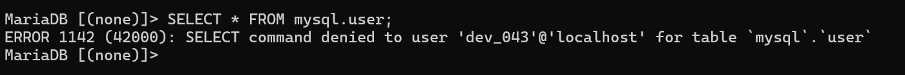
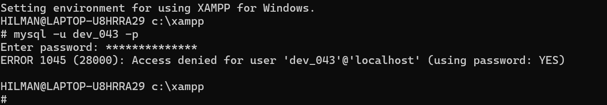
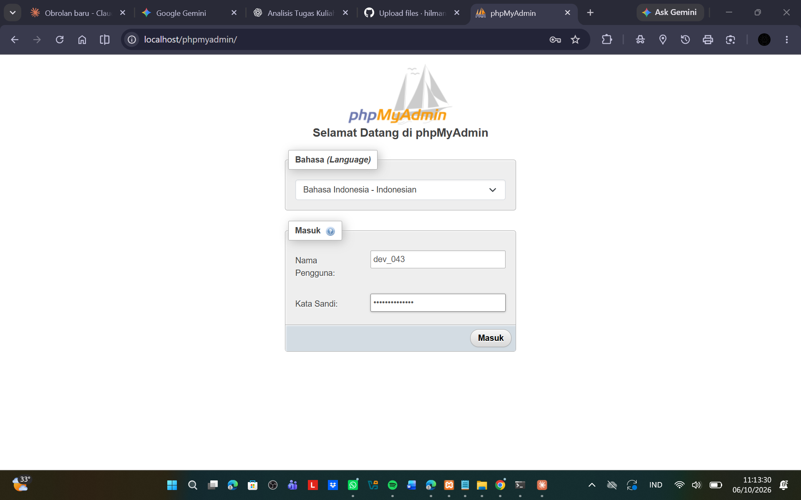
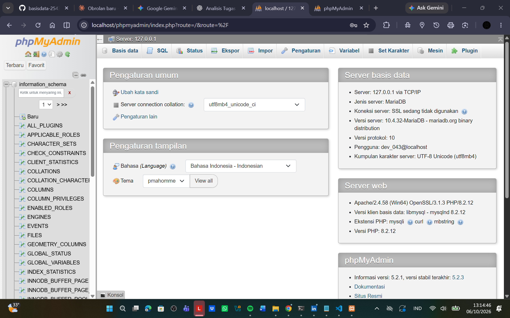
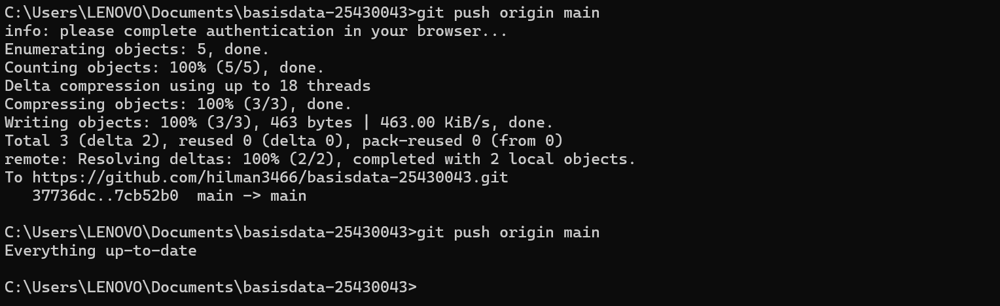

# Laporan Praktikum Basis Data - Pertemuan 1

**Nama:** HILMAN AHMAD ROSYAD  
**NIM:** 25430043  
**Kelas:** B  
**Tanggal:** 06 Oktober 2026  

## 1. Tujuan Praktikum

Pada praktikum pertama ini saya belajar menyiapkan lingkungan kerja basis data menggunakan XAMPP dan MariaDB. Selain itu, saya mencoba masuk ke MariaDB melalui terminal dan phpMyAdmin, membuat akun pengguna, mengatur hak akses, membuat basis data proyek, serta mencatat pekerjaan menggunakan Git dan GitHub.

Tujuan lainnya adalah memahami perbedaan antara akun yang memiliki hak administrator dengan akun kerja yang hanya boleh mengakses basis data tertentu.

## 2. Ringkasan Dasar Teori

MariaDB merupakan sistem manajemen basis data yang bekerja dengan model client-server. MariaDB server menerima perintah dari client, misalnya program `mysql` di terminal atau phpMyAdmin. Setelah perintah diproses, hasil atau pesan error dikembalikan kepada client.

Dalam MariaDB, akun pengguna tidak hanya ditentukan oleh nama user, tetapi juga oleh host. Contohnya adalah `dev_043@localhost`. Karena itu, satu nama pengguna dapat memiliki hak akses yang berbeda apabila host-nya berbeda.

Pengaturan hak akses digunakan untuk membatasi apa saja yang dapat dilakukan oleh suatu akun. Pada praktikum ini digunakan prinsip least privilege, yaitu akun kerja tidak diberi hak yang lebih besar dari yang dibutuhkan.

Git digunakan untuk mencatat perubahan file dalam bentuk commit. GitHub digunakan sebagai tempat menyimpan repositori sehingga hasil pekerjaan dapat dilihat dan riwayat perubahan dapat dilacak.

## 3. Hasil Langkah Percobaan

### 3.1 Menjalankan MariaDB melalui XAMPP

MariaDB dijalankan melalui XAMPP Control Panel. Setelah layanan berjalan, MariaDB dapat menerima koneksi dari client.

Pada tahap ini saya memastikan layanan database dapat digunakan sebelum melanjutkan ke langkah berikutnya.

**Bukti:** SS-01 - XAMPP Control Panel / MariaDB berjalan.

### 3.2 Masuk ke MariaDB melalui CLI

Saya masuk ke MariaDB menggunakan terminal melalui XAMPP Shell. Setelah prompt `MariaDB [(none)]>` muncul, berarti koneksi ke server sudah berhasil.

Saya kemudian menjalankan:

`SELECT VERSION(), CURRENT_USER();`

Hasilnya menunjukkan:

- Versi MariaDB: `10.4.32-MariaDB`
- User: `dev_043@localhost`

Hasil ini digunakan untuk memastikan versi server dan akun yang sedang digunakan.

**Bukti:** 

### 3.3 Memeriksa SQL Mode

Saya menjalankan:

`SELECT @@sql_mode;`

Hasil yang diperoleh adalah:

`STRICT_TRANS_TABLES,ERROR_FOR_DIVISION_BY_ZERO,NO_AUTO_CREATE_USER,NO_ENGINE_SUBSTITUTION`

Dari hasil tersebut terlihat bahwa `STRICT_TRANS_TABLES` aktif. Mode ini berguna untuk membuat server lebih ketat dalam menangani data yang tidak sesuai.

**Bukti:** 

### 3.4 Membuat Basis Data Latihan dan Akun Kerja

Saya membuat basis data latihan `kopma_043` dan akun `mhs_043` untuk digunakan pada bagian latihan.

Akun tersebut kemudian diberikan hak akses pada basis data `kopma_043`.

### 3.5 Membuat Basis Data Proyek

Sesuai tema proyek, saya menggunakan tema Toko Daring.

Basis data proyek yang dibuat adalah:

`tokodaring_043`

Basis data tersebut menggunakan:

- Character set: `utf8mb4`
- Collation: `utf8mb4_unicode_ci`

Penggunaan nama `tokodaring_043` disesuaikan dengan tema proyek dan tiga digit terakhir NIM saya.

### 3.6 Membuat Akun Proyek

Akun proyek yang digunakan adalah:

`dev_043@localhost`

Akun ini dibuat khusus untuk kebutuhan proyek.

### 3.7 Memberikan Hak Akses

Akun `dev_043` diberikan hak akses pada basis data:

`tokodaring_043`

Saya kemudian memeriksa hak akses tersebut dengan:

`SHOW GRANTS;`

Hasilnya menunjukkan bahwa `dev_043` mempunyai hak akses pada `tokodaring_043`.

**Bukti:** 

### 3.8 Menguji Batas Hak Akses

Untuk memastikan pembatasan hak akses benar-benar bekerja, saya mencoba membuka basis data latihan menggunakan akun proyek.

Perintah yang digunakan:

`USE kopma_043;`

Hasilnya:

`ERROR 1044`

Artinya akun `dev_043` berhasil dikenali oleh MariaDB, tetapi tidak diberikan izin untuk membuka basis data `kopma_043`.

Saya juga mencoba:

`SELECT * FROM mysql.user;`

Hasilnya:

`ERROR 1142`

Artinya akun `dev_043` tidak memiliki izin untuk menjalankan perintah SELECT pada tabel `mysql.user`.

**Bukti:** 

**Bukti:** 

### 3.9 Pengujian Autentikasi

Saya melakukan pengujian login dengan password yang tidak sesuai. Hasil yang muncul adalah:

`ERROR 1045`

Dari percobaan tersebut saya dapat melihat bahwa ERROR 1045 berkaitan dengan proses autentikasi atau login.

**Bukti:** 

### 3.10 Konfigurasi phpMyAdmin

Pada awalnya phpMyAdmin masih menggunakan konfigurasi login otomatis. Setelah akun root diberi password, konfigurasi tersebut menyebabkan koneksi ditolak.

Saya kemudian mengubah `auth_type` pada `config.inc.php` menjadi:

`cookie`

Setelah itu phpMyAdmin menampilkan halaman login sehingga username dan password dapat dimasukkan secara langsung.

Saya berhasil masuk menggunakan akun `dev_043` dan dapat melihat basis data proyek `tokodaring_043`.

**Bukti:** 
**Bukti:** 

### 3.11 Menyimpan Pekerjaan ke GitHub

Repositori proyek yang digunakan adalah:

`https://github.com/hilman3466/basisdata-25430043`

Berkas utama yang sudah ditambahkan adalah:

- `README.md`
- `.gitignore`
- `p01_lingkungan_25430043.sql`
- `laporan/p01_laporan_25430043.md`
- `laporan/img/`

Commit yang dibuat pada Pertemuan 1 antara lain:

- `p01: tambah gitignore`
- `p01: tambah skrip lingkungan`
- `p01: tambah bukti git push`
- `p01: tambah laporan praktikum`
- `p01: tambah folder bukti`
- `p01: tambah bukti show grants`
- `p01: tambah bukti error 1045`
- `p01: tambah bukti phpmyadmin dev043`
- `p01: rapikan laporan`
- `p01: rapikan bukti laporan`

Hal ini membuat pekerjaan pada Pertemuan 1 memiliki riwayat perubahan yang jelas.

**Bukti:** 

## 4. Jawaban Titik Analisis

### Titik Analisis 1

Walaupun tombol yang digunakan pada XAMPP bertuliskan MySQL, server yang digunakan dalam praktikum ini adalah MariaDB. Karena itu, saat mencari solusi di internet saya harus memperhatikan apakah contoh tersebut cocok untuk MariaDB atau hanya untuk MySQL.

Dokumentasi MySQL masih bisa membantu pada bagian yang kompatibel, tetapi untuk hal yang spesifik sebaiknya saya memeriksa dokumentasi MariaDB.

### Titik Analisis 2

Setelah root diberi password, login tanpa mengirim password dapat menyebabkan ERROR 1045. Dari pesan error tersebut dapat diketahui apakah password tidak dikirim atau password yang diberikan tidak sesuai.

Hal ini berbeda dengan ERROR 1044 karena ERROR 1044 terjadi setelah user berhasil dikenali tetapi tidak memiliki izin terhadap database yang diminta.

### Titik Analisis 3

`information_schema` tetap dapat terlihat oleh akun kerja karena berisi metadata tentang objek database. Sebaliknya, database seperti `mysql` tidak otomatis dapat dibuka oleh akun kerja yang tidak mempunyai hak akses.

Pada percobaan saya, `dev_043` dapat melihat `information_schema` dan `tokodaring_043`, tetapi ketika mencoba `USE kopma_043` muncul ERROR 1044.

### Titik Analisis 4

Mode cookie pada phpMyAdmin lebih aman dibandingkan konfigurasi login otomatis karena pengguna diminta memasukkan username dan password pada halaman login. Password tidak perlu ditulis langsung pada konfigurasi koneksi.

## 5. Hasil Latihan dan Modifikasi

Pada bagian latihan saya melakukan pengujian hak akses dan autentikasi untuk melihat respon MariaDB terhadap kondisi yang berbeda.

Hasil pengujian menunjukkan bahwa akun dengan hak akses terbatas memang tidak dapat membuka database yang tidak diberikan izin. Selain itu, akun tersebut juga tidak dapat membaca tabel sistem yang tidak menjadi haknya.

Saya juga menguji penggunaan skrip SQL dengan konsep `IF NOT EXISTS` agar pembuatan database dan akun dapat dilakukan kembali tanpa menimbulkan error karena objek sudah ada.

## 6. Tugas Mandiri: Milestone Proyek 1

Pada milestone pertama saya mulai membuat dasar proyek pribadi dengan tema Toko Daring.

Identitas proyek:

- Nama organisasi: RakitRuang HAR
- Tema: Toko Daring
- Kode tema: `tokodaring`
- Basis data proyek: `tokodaring_043`
- Akun proyek: `dev_043`

Akun `dev_043` diberikan hak akses pada `tokodaring_043`.

Saya kemudian melakukan pengujian dengan mencoba membuka `kopma_043` menggunakan akun `dev_043`. Hasilnya muncul ERROR 1044. Dari pengujian tersebut dapat dibuktikan bahwa akun proyek tidak diberikan akses ke database latihan.

Repositori proyek:

`https://github.com/hilman3466/basisdata-25430043`

## 7. Pembahasan dan Kendala

Selama mengerjakan praktikum saya mengalami beberapa kendala pada bagian autentikasi.

Kendala pertama adalah login akun `mhs_043` yang sempat menghasilkan ERROR 1045 karena password yang digunakan tidak sesuai. Setelah password diperbaiki, akun dapat digunakan kembali.

Kendala berikutnya terjadi pada phpMyAdmin. Setelah root diberi password, phpMyAdmin masih mencoba masuk menggunakan konfigurasi lama sehingga koneksi ditolak. Masalah tersebut diperbaiki dengan mengubah metode autentikasi menjadi cookie.

Saya juga sempat mengalami masalah ketika mengakses database yang tidak memiliki izin. Dari situ saya bisa melihat secara langsung perbedaan antara masalah login dan masalah hak akses.

Menurut saya bagian yang paling membantu adalah pengujian ERROR 1044, ERROR 1045, dan ERROR 1142 karena dari ketiga percobaan tersebut saya bisa melihat bahwa pesan error MariaDB tidak semuanya berarti hal yang sama.

## 8. Kesimpulan

Praktikum Pertemuan 1 berhasil membantu saya menyiapkan lingkungan kerja MariaDB menggunakan XAMPP, membuat akun pengguna, membuat database proyek, dan mengatur hak akses.

Saya juga berhasil membuat database `tokodaring_043` dan akun `dev_043`, kemudian membuktikan bahwa akun tersebut tidak dapat membuka `kopma_043`. Selain itu, pekerjaan praktikum sudah mulai dicatat di GitHub agar perubahan proyek dapat dilacak.

## 9. Pernyataan Penggunaan AI

Saya menggunakan AI sebagai alat bantu untuk memahami materi, menjelaskan perintah MariaDB, membaca pesan error, memahami struktur Git dan GitHub, serta membantu merapikan penjelasan pada laporan.

Pelaksanaan perintah, pengujian database, pengambilan screenshot, dan hasil praktikum dilakukan pada lingkungan kerja saya sendiri.

## 10. Bukti Git

**Repositori:**

https://github.com/hilman3466/basisdata-25430043

**Commit Pertemuan 1:**

- `p01: tambah gitignore`
- `p01: tambah skrip lingkungan`

Bukti commit dan isi repositori disimpan pada GitHub.

## Checklist

- [x] `p01_lingkungan_25430043.sql`
- [x] `README.md` berisi Identitas Proyek
- [x] `.gitignore`
- [x] `SELECT VERSION(), CURRENT_USER();`
- [x] `SELECT @@sql_mode;`
- [x] `SHOW DATABASES` sebagai `dev_043`
- [x] `SHOW DATABASES` sebagai `mhs_043`
- [x] Bukti ERROR 1044
- [x] Bukti ERROR 1142
- [x] Halaman masuk phpMyAdmin mode cookie
- [x] GitHub dan commit
- [ ] Analisis perbedaan ERROR 1044, 1045, dan 1142