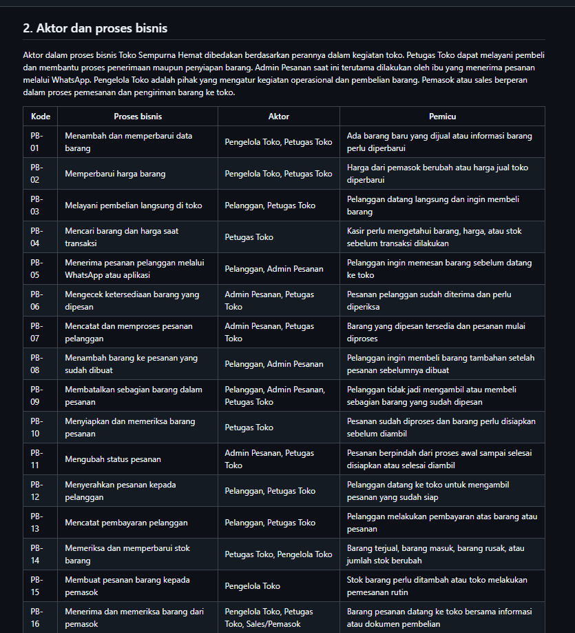
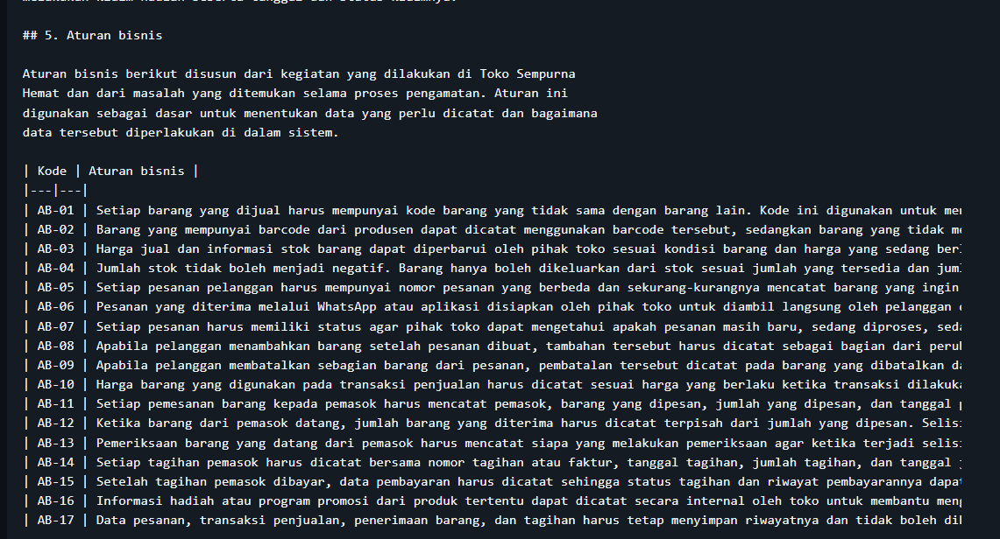
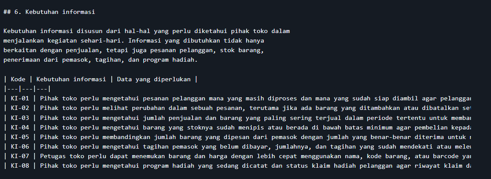
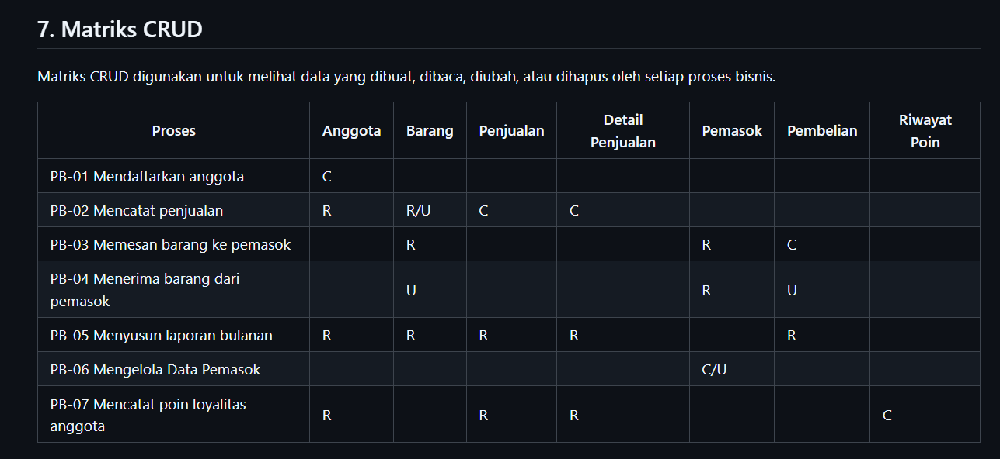
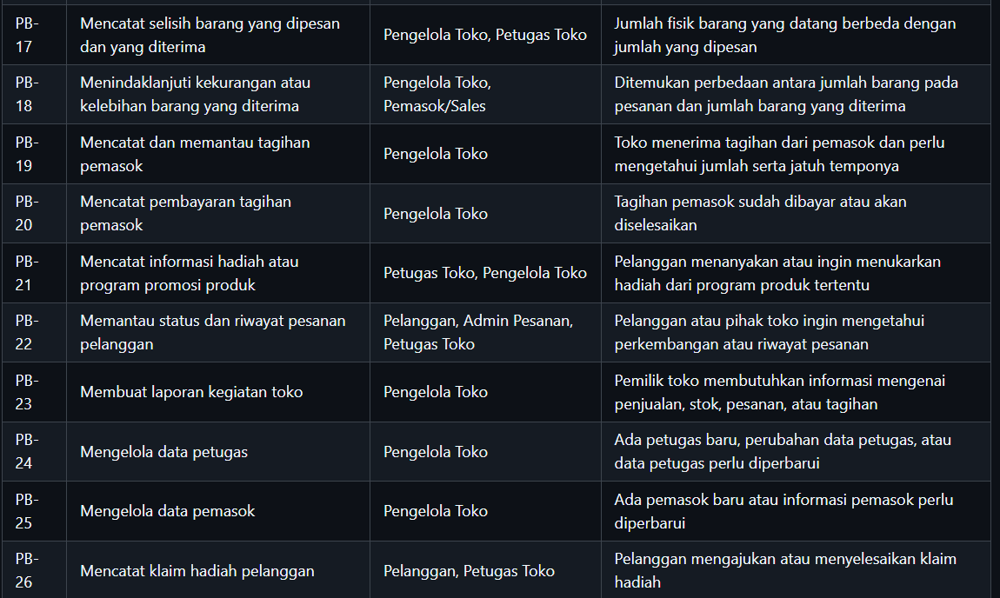
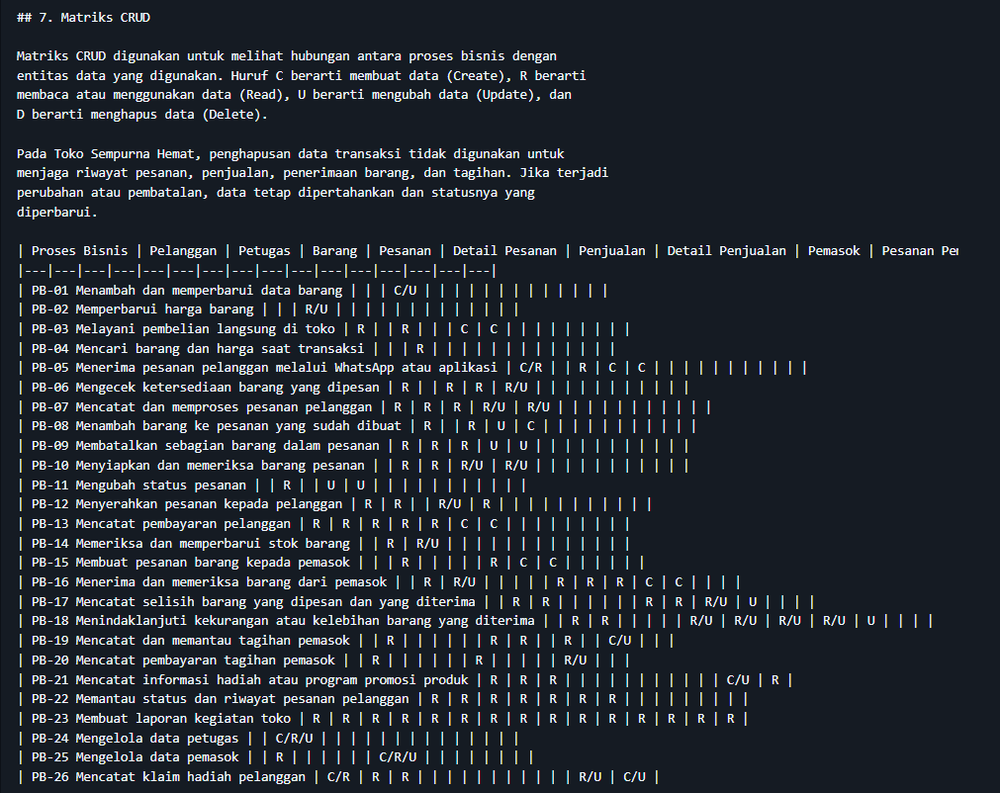
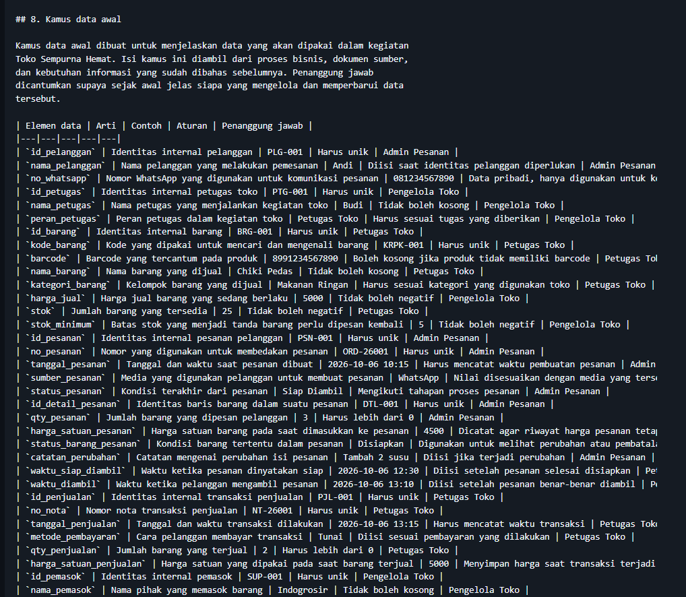
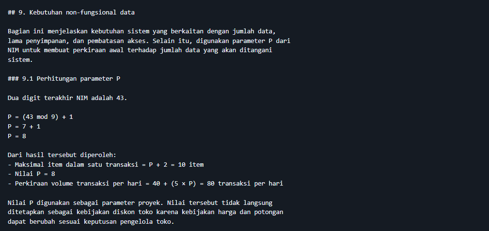
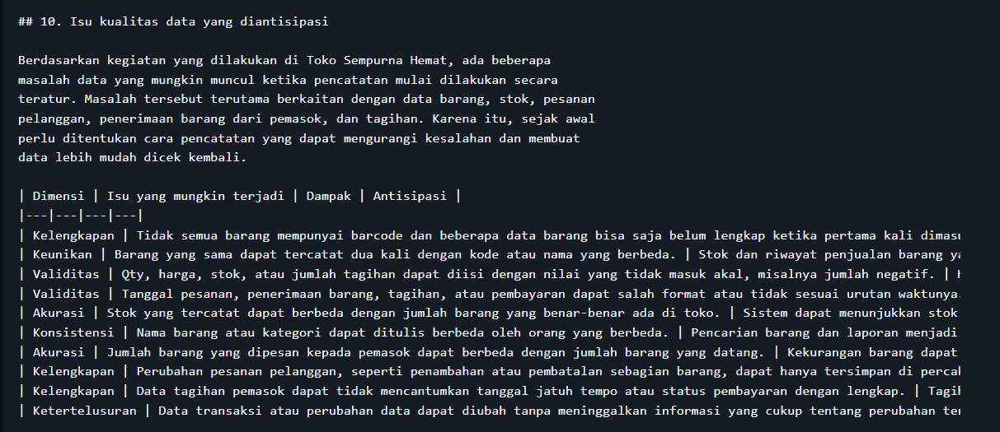

# Laporan Praktikum Basis Data - Pertemuan 2

**Nama:** HILMAN AHMAD ROSYAD  
**NIM:** 25430043  
**Kelas:** B  
**Tanggal:** 06 Oktober 2026  

## 1. Tujuan Praktikum

Pada praktikum kedua ini saya belajar menganalisis kebutuhan data sebelum
membuat rancangan basis data. Saya mengidentifikasi aktivitas, aktor, proses
bisnis, entitas, aturan bisnis, dan kebutuhan informasi dari suatu organisasi.
Saya juga belajar menyusun matriks CRUD, kamus data, serta kebutuhan data yang
jelas dan dapat diuji.

## 2. Ringkasan Dasar Teori

Analisis kebutuhan merupakan tahap awal dalam perancangan basis data. Sebelum
membuat tabel atau ERD, perlu dipahami dulu kegiatan organisasi dan data apa
saja yang muncul dari kegiatan tersebut. Kesalahan pada tahap ini bisa membuat
rancangan berikutnya ikut bermasalah.

Data juga dipandang sebagai aset organisasi, sehingga bukan hanya perlu dicatat,
tetapi juga harus jelas siapa yang bertanggung jawab dan bagaimana kualitasnya
dijaga. Kebutuhan data dapat ditemukan dari wawancara, pengamatan proses,
dokumen sumber, dan sistem yang sudah digunakan sebelumnya.

Dalam analisis, data yang ditemukan kemudian dikelompokkan menjadi entitas,
aturan bisnis, dan kebutuhan informasi. Hubungan antara proses dan data dapat
diperiksa dengan matriks CRUD, sedangkan kamus data digunakan untuk menjelaskan
arti, contoh, aturan, dan penanggung jawab setiap elemen data. Kebutuhan yang
ditulis juga sebaiknya spesifik, terukur, dan bisa diuji agar mudah diterapkan
pada tahap perancangan berikutnya.

## 3. Hasil Langkah Percobaan

### 3.1 Mengidentifikasi aktivitas, aktor, dan proses bisnis

Pada tahap awal saya mengidentifikasi kegiatan yang dilakukan di Toko Sempurna
Hemat. Dari kegiatan tersebut saya menentukan pihak yang terlibat dalam
operasional toko, yaitu pelanggan, Admin Pesanan, Petugas Toko, Pengelola Toko,
serta pemasok atau sales.

Kegiatan yang ditemukan kemudian saya susun menjadi proses bisnis dan diberi kode
PB-01 sampai PB-26. Proses tersebut mencakup kegiatan penjualan, pemesanan
melalui WhatsApp atau aplikasi, penyiapan dan pengambilan pesanan, pengelolaan
stok, pembelian barang dari pemasok, penerimaan barang, pencatatan tagihan,
serta pengelolaan program dan klaim hadiah.

Hasil lengkap proses bisnis dicantumkan pada bagian 2 dokumen
`p02_kebutuhan_data_25430043.md`.

**Bukti screenshot proses bisnis:**

### 3.2 Membedah dokumen sumber

Pada tahap ini saya membuat dan menganalisis dokumen sumber yang sesuai dengan
kegiatan di Toko Sempurna Hemat. Dokumen yang digunakan terdiri dari Formulir
Pesanan dan Pengambilan Pelanggan, Formulir Penerimaan Barang dari Pemasok,
serta Catatan Tagihan Pemasok.

Dokumen pesanan digunakan untuk melihat data yang muncul saat pelanggan memesan
barang melalui WhatsApp atau aplikasi sampai barang tersebut siap diambil di
toko. Dari dokumen tersebut ditemukan data seperti nama pelanggan, nomor
WhatsApp, nomor pesanan, barang, jumlah, harga, status pesanan, dan waktu
pengambilan.

Dokumen penerimaan barang digunakan untuk melihat data barang yang dipesan dari
pemasok, jumlah yang diterima, serta kemungkinan adanya selisih. Catatan
tagihan pemasok digunakan untuk melihat informasi tagihan, jumlah yang harus
dibayar, tanggal tagihan, jatuh tempo, dan status pembayaran.

Hasil pembedahan dokumen sumber dicantumkan pada bagian 3 dokumen kebutuhan data
proyek.

### 3.3 Menentukan entitas kandidat dan elemen data

Data yang ditemukan dari proses bisnis dan dokumen sumber kemudian saya
kelompokkan berdasarkan kesamaan fungsi dan informasi yang dijelaskan. Dari
hasil tersebut diperoleh beberapa entitas kandidat, yaitu Pelanggan, Petugas,
Barang, Pesanan, Detail Pesanan, Penjualan, Pemasok, Pesanan Pembelian, Detail
Pesanan Pembelian, Penerimaan Barang, Detail Penerimaan, Tagihan Pemasok,
Pembayaran Tagihan, Program Hadiah, dan Klaim Hadiah.

Setiap entitas kemudian diberi elemen data utama yang diperlukan untuk
mendukung proses bisnisnya. Pengelompokan ini dilakukan agar data yang masih
berupa informasi campuran dapat dipisahkan menjadi kelompok data yang lebih
jelas dan nantinya lebih mudah digunakan saat membuat ERD.

Hasil lengkap entitas kandidat dan elemen data dicantumkan pada bagian 4
dokumen kebutuhan data proyek.

### 3.4 Menyusun aturan bisnis

Setelah entitas kandidat ditentukan, saya menyusun aturan bisnis berdasarkan
cara kerja toko dan masalah yang ditemukan dalam kegiatan sehari-hari. Aturan
tersebut mencakup penggunaan kode barang, pengelolaan harga dan stok,
perubahan pesanan pelanggan, penerimaan barang dari pemasok, pencatatan
tagihan, program hadiah, dan penyimpanan riwayat transaksi.

Setiap aturan diberi kode AB-01 dan seterusnya supaya dapat digunakan sebagai
acuan ketika membahas kebutuhan data dan rancangan basis data pada tahap
berikutnya.

Hasil lengkap aturan bisnis dicantumkan pada bagian 5 dokumen kebutuhan data
proyek.

**Bukti screenshot aturan bisnis:**

### 3.5 Menyusun kebutuhan informasi dan matriks CRUD

Kebutuhan informasi disusun dari hal-hal yang perlu diketahui oleh pihak toko
dalam menjalankan kegiatan sehari-hari. Informasi tersebut meliputi status dan
perubahan pesanan, penjualan, kondisi stok, selisih barang dari pemasok,
tagihan yang belum dibayar, pencarian barang dan harga, serta status klaim
hadiah.

Setelah itu saya membuat matriks CRUD untuk melihat data apa saja yang dibuat,
dibaca, diubah, atau dihapus pada setiap proses bisnis. Matriks ini juga saya
gunakan untuk memeriksa apakah ada entitas yang belum mempunyai proses untuk
membuat datanya.

Dari pemeriksaan tersebut terlihat bahwa data Petugas, Pemasok, dan Klaim
Hadiah perlu memiliki proses pencatatan yang jelas. Karena itu ditambahkan
PB-24, PB-25, dan PB-26 agar seluruh entitas memiliki proses pembentukan data
yang dapat dijelaskan.

Hasil kebutuhan informasi dan matriks CRUD dicantumkan pada bagian 6 dan 7
dokumen kebutuhan data proyek.

**Bukti screenshot kebutuhan informasi:**

**Bukti screenshot matriks CRUD:**

### 3.6 Menyusun kamus data awal

Setelah entitas dan kebutuhan data ditentukan, saya menyusun kamus data awal
untuk menjelaskan nama elemen data, arti, contoh nilai, aturan pengisian, dan
pihak yang bertanggung jawab.

Penanggung jawab dicantumkan berdasarkan peran dalam kegiatan toko, seperti
Admin Pesanan, Petugas Toko, dan Pengelola Toko. Dengan cara ini, pengelolaan
data dapat dikaitkan langsung dengan tugas pihak yang menggunakan atau
memperbarui data tersebut.

Hasil kamus data awal dicantumkan pada bagian 8 dokumen kebutuhan data proyek.

**Bukti screenshot kamus data:**

### 3.7 Menentukan kebutuhan non-fungsional dan isu kualitas data

Pada tahap akhir saya menentukan kebutuhan yang berkaitan dengan jumlah data
yang perlu ditangani, lama penyimpanan, data pribadi, dan hak akses. Kebutuhan
tersebut dibuat agar sejak awal sudah jelas bagaimana data digunakan dan siapa
yang boleh melihat atau mengubahnya.

Saya juga mengidentifikasi beberapa masalah kualitas data yang mungkin terjadi
di toko, seperti data barang yang belum lengkap, barang yang tercatat lebih dari
satu kali, perbedaan antara stok sistem dan stok fisik, selisih jumlah barang
dari pemasok, perubahan pesanan yang hanya tersimpan di WhatsApp, serta data
tagihan yang tidak lengkap.

Hasil kebutuhan non-fungsional dan isu kualitas data dicantumkan pada bagian 9
dan 10 dokumen kebutuhan data proyek.

**Bukti screenshot kebutuhan non-fungsional dan parameter P:**

**Bukti screenshot isu kualitas data:**

## 4. Jawaban Titik Analisis

### Titik Analisis 1 — Harga saat transaksi

Harga yang tersimpan pada data barang merupakan harga yang berlaku saat ini.
Namun, harga ketika transaksi terjadi tetap perlu dicatat pada detail transaksi.

Misalnya suatu barang dibeli dengan harga Rp5.000, lalu beberapa waktu kemudian
harga barang tersebut naik menjadi Rp6.000. Kalau transaksi lama hanya mengambil
harga dari data barang yang terbaru, nota lama akan terlihat menggunakan harga
Rp6.000. Padahal saat transaksi dilakukan, pelanggan sebenarnya membayar
Rp5.000.

Karena itu, harga saat transaksi perlu disimpan pada detail transaksi. Dengan
cara tersebut, perubahan harga barang di kemudian hari tidak mengubah riwayat
transaksi yang sudah terjadi. Hal ini juga membuat transaksi lama lebih mudah
diperiksa kembali.

### Titik Analisis 2 — Nilai turunan

Subtotal dan total merupakan nilai yang dapat dihitung dari data lain. Subtotal
dapat diperoleh dari jumlah barang dikalikan harga satuan, sedangkan total dapat
diperoleh dari seluruh rincian transaksi dan potongan yang berlaku.

Salah satu alasan untuk tidak menyimpan subtotal dan total adalah karena nilai
tersebut bisa dihitung kembali. Jadi, tidak perlu menyimpan nilai yang sebenarnya
sudah bisa diperoleh dari data sumber. Cara ini juga dapat mengurangi risiko
nilai hasil perhitungan berbeda dengan data aslinya.

Di sisi lain, total masih dapat dipertimbangkan untuk disimpan apabila angka
tersebut merupakan nilai akhir yang benar-benar tercatat atau dibayarkan saat
transaksi terjadi. Hal ini berguna untuk menjaga nilai historis ketika aturan
harga atau potongan berubah.

Pada tahap analisis ini saya belum menetapkan keputusan akhir untuk semua nilai
turunan. Keputusan tersebut akan diperiksa kembali pada tahap normalisasi.

### Titik Analisis 3 — Pemeriksaan matriks CRUD

Pada matriks CRUD terdapat kemungkinan sebuah entitas digunakan oleh proses
lain, tetapi tidak pernah mempunyai proses `C` atau Create. Jika hal tersebut
terjadi, berarti proses untuk membuat atau mencatat data entitas tersebut belum
terlihat dalam daftar proses bisnis.

Pada contoh yang diberikan di modul, kolom Pemasok tidak memiliki huruf `C`.
Artinya belum ada proses yang secara jelas membuat atau mencatat data pemasok.
Solusinya adalah menambahkan proses untuk mengelola atau mencatat data pemasok
sebelum data tersebut digunakan dalam proses pembelian.

Selain itu, perubahan status aktif anggota juga perlu memiliki proses yang jelas.
Jika status anggota dapat berubah tetapi tidak ada proses yang melakukan `U`,
maka proses perubahan status tersebut belum tercatat.

Dari pemeriksaan ini saya juga menerapkan hal yang sama pada proyek Toko
Sempurna Hemat. Hasil pemeriksaan CRUD proyek menunjukkan bahwa data Petugas,
Pemasok, dan Klaim Hadiah perlu mempunyai proses pencatatan yang jelas. Karena
itu saya menambahkan PB-24 untuk mengelola data petugas, PB-25 untuk mengelola
data pemasok, dan PB-26 untuk mencatat klaim hadiah pelanggan.

### 4.1 Perhitungan Parameter P

Dua digit terakhir NIM saya adalah 43.

P = (43 mod 9) + 1  
P = 7 + 1  
P = 8

Berdasarkan nilai tersebut:

- Maksimal item dalam satu transaksi = P + 2 = 8 + 2 = **10 item**
- Nilai P = **8**
- Perkiraan volume transaksi per hari = 40 + (5 × 8) = **80 transaksi per hari**

Nilai P digunakan sebagai parameter dalam proyek. Nilai tersebut tidak langsung
ditetapkan sebagai kebijakan diskon toko karena keputusan mengenai potongan
harga tetap mengikuti kondisi dan keputusan pengelola toko.

### 4.2 Perbaikan Tiga Pernyataan Kebutuhan Kabur

#### (a) "Data pelanggan harus aman"

Nama pelanggan dan nomor WhatsApp hanya boleh dilihat oleh pihak yang memang
membutuhkan data tersebut untuk menangani pesanan. Pengujian dilakukan dengan
mencoba mengakses data pelanggan menggunakan akun dengan hak akses yang
berbeda. Hasil yang diharapkan adalah pengguna yang tidak mempunyai hak akses
tidak dapat melihat data tersebut.

#### (b) "Sistem harus cepat mencari barang"

Sistem harus dapat menampilkan hasil pencarian berdasarkan `kode_barang` atau
`nama_barang` dalam waktu maksimal 2 detik ketika jumlah data barang mencapai
5.000 data. Pengujian dilakukan dengan menjalankan beberapa pencarian dan
mengukur waktu sampai hasil pencarian ditampilkan.

#### (c) "Laporan stok harus akurat"

Jumlah stok yang ditampilkan pada sistem harus sama dengan jumlah barang yang
ditemukan saat pemeriksaan stok fisik, tanpa selisih. Pengujian dilakukan dengan
membandingkan data stok pada sistem dengan hasil pemeriksaan fisik.

## 5. Hasil Latihan dan Modifikasi

### 5.1 Latihan E.1 — Simulasi Poin Loyalitas

Pada latihan ini saya mengerjakan modifikasi berdasarkan kasus Kopma yang
diberikan pada modul praktikum. Aturan yang digunakan adalah setiap kelipatan
Rp10.000 dari belanja anggota mendapatkan 1 poin, dan 50 poin dapat ditukar
dengan potongan sebesar Rp5.000.

Untuk memenuhi latihan tersebut, saya menambahkan elemen data, aturan bisnis,
kebutuhan informasi, dan penyesuaian matriks CRUD yang diperlukan untuk
mencatat riwayat poin anggota. Data riwayat digunakan untuk mengetahui kapan
poin diperoleh atau digunakan serta jumlah poin yang berubah.

Latihan ini merupakan bagian dari latihan E.1 dan bukan aturan yang saat ini
digunakan oleh Toko Sempurna Hemat. Dokumen proyek Toko Sempurna Hemat tetap
menggunakan kebutuhan data yang berasal dari kegiatan toko yang telah
dianalisis pada milestone proyek.

Dengan demikian, hasil latihan Kopma digunakan untuk memahami cara
menambahkan kebutuhan data dan memperbarui hubungan proses dengan entitas,
sedangkan kebutuhan utama proyek tetap dipisahkan sesuai kondisi Toko
Sempurna Hemat.

### 5.2 Latihan E.2 — Perbaikan Pernyataan Kebutuhan Kabur

Pada latihan kedua saya memperbaiki tiga pernyataan kebutuhan yang masih terlalu
umum menjadi kebutuhan yang memiliki ukuran dan cara pengujian.

Pernyataan "data pelanggan harus aman" diperjelas dengan menentukan pihak yang
boleh melihat data pelanggan dan cara untuk menguji hak akses tersebut.
Pernyataan "sistem harus cepat mencari barang" diberi batas waktu maksimal
2 detik ketika jumlah data barang mencapai 5.000 data. Sementara itu,
"laporan stok harus akurat" diperjelas dengan ketentuan bahwa jumlah stok pada
sistem harus sama dengan hasil pemeriksaan stok fisik.

Hasil perbaikan tersebut dicantumkan pada bagian 4.2 sebagai bagian dari
analisis wajib Modul 2.

## 6. Tugas Mandiri: Milestone Proyek 2

Pada milestone kedua saya mulai menyusun dokumen kebutuhan data untuk Toko
Sempurna Hemat. Penyusunan dilakukan dengan melihat kegiatan toko sehari-hari,
terutama penjualan, pesanan pelanggan melalui WhatsApp atau aplikasi,
penyiapan dan pengambilan pesanan, pengelolaan stok, penerimaan barang dari
pemasok, pencatatan tagihan, serta pencatatan program hadiah.

Dokumen utama yang saya susun adalah
`p02_kebutuhan_data_25430043.md`. Isinya mencakup latar belakang organisasi,
aktor dan proses bisnis, dokumen sumber, entitas kandidat, aturan bisnis,
kebutuhan informasi, matriks CRUD, kamus data awal, kebutuhan non-fungsional,
dan isu kualitas data.

Beberapa masalah yang menjadi dasar analisis berasal dari kegiatan toko, seperti
pencarian barang yang masih dapat dilakukan secara manual karena tidak semua
barang mempunyai barcode, pesanan yang masuk melalui WhatsApp, perubahan isi
pesanan, perbedaan jumlah barang yang dipesan dan yang diterima dari pemasok,
serta tagihan pemasok yang dapat terlupakan.

Dari analisis tersebut saya menyusun 26 proses bisnis, 15 entitas kandidat,
17 aturan bisnis, dan 8 kebutuhan informasi. Matriks CRUD kemudian digunakan
untuk memeriksa apakah setiap entitas mempunyai proses yang membuat datanya.
Hasil pemeriksaan tersebut menjadi alasan penambahan PB-24 untuk mengelola data
petugas, PB-25 untuk mengelola data pemasok, dan PB-26 untuk mencatat klaim
hadiah pelanggan.

Kamus data awal juga disusun dengan mencantumkan arti elemen, contoh nilai,
aturan pengisian, dan penanggung jawab data. Penanggung jawab ditulis
berdasarkan peran dalam kegiatan toko, seperti Admin Pesanan, Petugas Toko,
dan Pengelola Toko.

Selain itu, saya menentukan kebutuhan non-fungsional yang berkaitan dengan
volume data, lama penyimpanan, data pribadi, dan hak akses. Parameter P dari
NIM 25430043 menghasilkan nilai P = 8, yang digunakan sebagai dasar untuk
menentukan maksimal 10 item dalam satu transaksi dan perkiraan 80 transaksi
per hari.

Hasil milestone ini akan menjadi dasar untuk perancangan ERD dan tahap
normalisasi pada pertemuan berikutnya. Jika pada tahap selanjutnya ditemukan
kebutuhan atau masalah baru, dokumen dapat diperbarui agar tetap sesuai dengan
kondisi dan kebutuhan toko.

## 7. Pembahasan dan Kendala

Selama menyusun kebutuhan data Toko Sempurna Hemat, kendala yang paling saya
rasakan adalah menentukan kegiatan mana yang benar-benar perlu dicatat sebagai
proses bisnis dan data apa yang muncul dari kegiatan tersebut. Beberapa kegiatan
di toko masih dilakukan secara sederhana, seperti menerima pesanan melalui
WhatsApp, mencari barang dan harga secara manual, serta memeriksa barang yang
datang dari pemasok. Saya kemudian melihat kembali alur kegiatan tersebut agar
proses bisnis yang dibuat tetap sesuai dengan keadaan toko.

Kendala berikutnya adalah menentukan entitas kandidat. Ada beberapa data yang
saling berhubungan, misalnya pesanan dengan detail barang, pembelian dengan
penerimaan barang, serta program hadiah dengan klaim pelanggan. Untuk
mengatasinya, data dikelompokkan berdasarkan fungsi dan kegiatan yang
menggunakannya. Dari situ saya bisa membedakan mana data utama dan mana data
rincian.

Saat membuat matriks CRUD, saya menemukan beberapa entitas yang belum memiliki
proses untuk membuat datanya. Setelah diperiksa kembali, saya menambahkan
PB-24 untuk mengelola data petugas, PB-25 untuk mengelola data pemasok, dan
PB-26 untuk mencatat klaim hadiah pelanggan. Penambahan ini dilakukan supaya
setiap entitas yang digunakan mempunyai proses yang jelas.

Ada juga kendala dalam menentukan cara mencatat perubahan pesanan pelanggan.
Pelanggan dapat menambah atau membatalkan sebagian barang setelah pesanan dibuat,
sedangkan komunikasi awalnya sering dilakukan melalui WhatsApp. Karena itu,
perubahan tersebut dicatat pada detail pesanan dan riwayatnya tetap
dipertahankan agar isi pesanan sebelumnya masih dapat ditelusuri.

Saya juga perlu membedakan masalah yang memang terjadi di toko dengan bagian
latihan dari modul. Contohnya pada latihan poin loyalitas, fitur tersebut tidak
saya anggap sebagai fitur yang sudah digunakan oleh toko, tetapi hanya sebagai
simulasi untuk memenuhi latihan E.1.

Dari proses pengerjaan ini saya melihat bahwa perubahan pada satu bagian dapat
berpengaruh ke bagian lain. Misalnya, ketika ada entitas baru, matriks CRUD,
aturan bisnis, dan kamus data juga perlu diperiksa kembali. Karena itu, setelah
setiap bagian selesai saya melakukan pengecekan ulang agar isi dokumen tetap
saling berhubungan.

## 8. Kesimpulan

Pada praktikum kedua ini saya berhasil menyusun kebutuhan data untuk Toko
Sempurna Hemat berdasarkan kegiatan yang ada di toko. Dari proses tersebut saya
dapat menentukan proses bisnis, entitas, aturan bisnis, kebutuhan informasi,
matriks CRUD, kamus data, serta kebutuhan non-fungsional yang akan digunakan
sebagai dasar untuk perancangan basis data selanjutnya.

## 9. Pernyataan Penggunaan AI

Saya menggunakan AI sebagai alat bantu selama mengerjakan praktikum ini. AI
digunakan untuk membantu memahami materi Modul 2, menjelaskan konsep seperti
entitas, aturan bisnis, matriks CRUD, dan kebutuhan data, serta membantu
memeriksa dan merapikan penjelasan pada dokumen dan laporan.

Bagian yang berkaitan dengan kondisi Toko Sempurna Hemat, masalah yang terjadi,
proses bisnis, dan keputusan data berasal dari hasil pengamatan dan pembahasan
proyek saya sendiri. Pelaksanaan pekerjaan, pengecekan hasil, pengambilan
bukti, dan pengelolaan repositori dilakukan oleh saya.

## 10. Bukti Git

Repositori proyek:

https://github.com/hilman3466/basisdata-25430043

Berkas yang dikerjakan pada Pertemuan 2:

- `p02_kebutuhan_data_25430043.md`
- `p02_kebutuhan_data_kopma_25430043.md`
- `laporan/p02_laporan_25430043.md`

Commit Pertemuan 2:

- `79181d91be4394fb66ebc60f5ba475700fef6d41` — `p02: finalisasi laporan`

  ## Checklist

- [x] `p02_kebutuhan_data_25430043.md`
- [x] `p02_kebutuhan_data_kopma_25430043.md`
- [x] `laporan/p02_laporan_25430043.md`
- [x] PB-01 sampai PB-26
- [x] AB-01 sampai AB-17
- [x] KI-01 sampai KI-08
- [x] Matriks CRUD
- [x] Kamus data awal
- [x] Kebutuhan non-fungsional dan parameter P
- [x] Isu kualitas data
- [x] Titik Analisis 1–3
- [x] Latihan E.1
- [x] Latihan E.2
